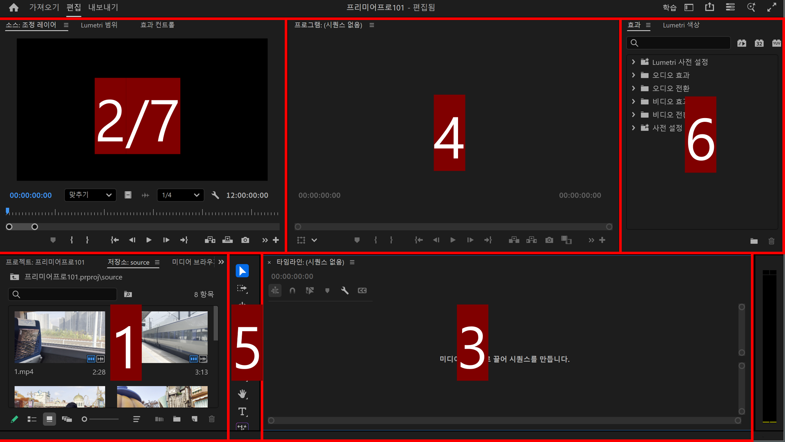
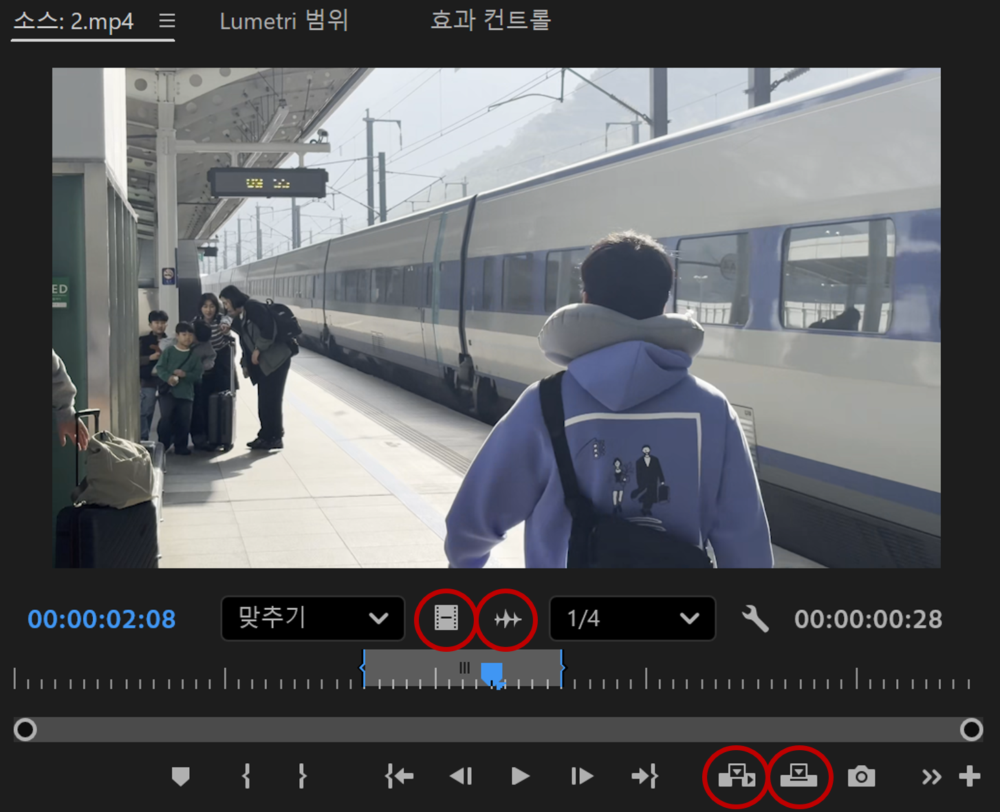

# 프리미어 프로 101

## 1. 시작하기  

### 1.1 프로젝트 만들기  

- 프로젝트 이름 정하기
- 파일 가져오기
- 시퀀스 만들기

```plaintext
실습: 프로젝트 만들고 시퀀스 설정 바꿔보기
```

### 1.2 UI에 익숙해지기  



1. 프로젝트 패널
2. 소스 패널
3. 타임라인 패널
4. 프로그램 패널
5. 툴 바
6. 효과 패널
7. 효과 컨트롤 패널

```plaintext
실습: UI 패널 확인하고, 크기 조절해보기 / 프로젝트 패널에 파일이 잘 있는지 확인!
```

## 2. 컷편집  

### 2.1 자료 미리보기 및 삽입하기  

#### 소스 패널 활용하기



- <code>I</code> In점 설정     
- <code>O</code> Out점 설정      

- <code>Ctrl + Shift + I</code> In점 지우기     
- <code>Ctrl + Shift + O</code> Out점 지우기  

#### 영상을 타임라인에 넣기  

- 삽입/덮어쓰기
- 영상만 넣기 or 오디오만 넣기  

- <code>방향키 위/아래</code> 클립 앞, 뒤로 재생 헤드 이동
- <code>+</code> <code>-</code> 확대/축소

```plaintext
실습: 소스 패널에서 In점, Out점 잡아보고 비디오만 타임라인에 드래그, 파일 1~6 순서대로 나열하기
```

### 2.2 영상 및 오디오 자르고 붙이기  

- <code>Ctrl + K</code> 자르기  
- 양 끝을 잡아서 드래그하여 잘라내기/늘이기  

- 자석 기능 on/off 가능  
- 잔물결 삭제(영상 사이 빈 공간 없애기)

```plaintext
실습: 타임라인에서 추가로 영상 컷편집 해보기
```

## 3. 비디오 효과  

- 효과 패널에서 찾아서 영상으로 드래그  
- 효과 컨트롤 패널에서 세부조절  
- 효과 컨트롤 패널에서 <code>fx</code> 클릭해서 적용하기 전 상태 확인

```plaintext
실습: 효과 패널에서 "노이즈" 검색, 드래그해서 1번 영상에 넣어보고 효과 컨트롤 패널에서 노이즈 양 조절해보기
```

## 4. 비디오 트랜지션  

- 효과 패널에서 찾아서 영상 이음새에 드래그하기
- 이음새를 클릭해서 시간 조정 가능

```plaintext
실습: 영상 1~6 사이사이에 "교차 디졸브" 드래그해서 넣고, 시간을 00:00:00:15로 변경해보기
```

## 5. 색보정  

### Lumetri 색상  

- 효과 패널에서 <code>Lumetri 색상</code> 찾아서 영상에 드래그
- 효과 컨트롤 패널에서 세부 조정하기

```plaintext
실습: Lumetri 색상에서 흰색 균형 스포이트 사용해보고, 기본 교정의 항목들 세부 조정 해보기
```

## 6. 오디오

- 볼륨 조절
- 오디오 효과와 오디오 전환 (영상처럼 사용할 곳에 드래그하기!)
- Fade In, Fade Out 적용해 보기

```plaintext
실습: Romantic Holiday.mp3 타임라인에 넣고 영상 끝에 맞추어 자르기
끝부분에 "지속 가감속" 적용해서 Fade Out 적용해보기
```


## 7. 자막

- 자막 툴 사용하기
- 효과 컨트롤에서 다듬기  

```plaintext
실습: 툴 바에서 문자 도구(T모양) 선택하고 화면 중앙에 원하는 자막 넣기
선택 도구로 원하는 위치로 이동시키기 (심화: 효과 컨트롤 패널에서 기준점과 위치 조정)
자간, 칠, 선, 배경, 그림자 등 세부 조정 해보기
```

## 8. 키프레임  

### 이펙트에 활용하기  

#### 시계 아이콘 있는 항목에 적용 가능
- Fade in / Fade out
- 음량 조절
- 자막 불투명도 조절

```plaintext
실습: 효과 컨트롤 패널에서 "불투명도"에 키프레임 생성, 키프레임 2개로 불투명도 0->100 적용해보기
```

## 9. 유용한 기능

- 요소 중첩하기
- 조정 레이어 활용하기

```plaintext
실습: 조정 레이어를 이용, 1번 영상에 적용했었던 "노이즈"와 "Lumetri 색상"을 모든 영상에 대해 적용하기
```

## 10. 영상 내보내기  

#### 영상 범위 선택하기 (In점, Out점으로 범위 정하기)   

<code>I</code> In점 설정     
<code>O</code> Out점 설정      

<code>Ctrl + Shift + I</code> In점 지우기     
<code>Ctrl + Shift + O</code> Out점 지우기    

#### 화면 왼쪽 위 "내보내기" 클릭! or <code>Ctrl + M</code>

```plaintext
실습: 영상 내보내고 확인하기! 수고했어요 :)
```
